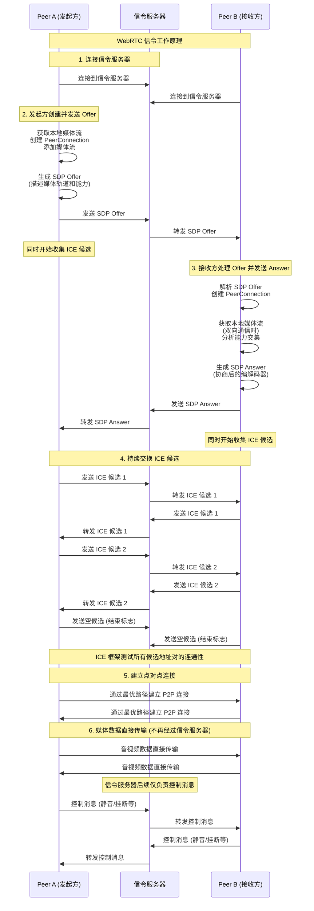

```mermaid
sequenceDiagram
    participant PeerA as Peer A (发起方)
    participant SignalingSvr as 信令服务器
    participant PeerB as Peer B (接收方)

    Note over PeerA, PeerB: WebRTC 信令工作原理

    %% Stage 1: 连接信令服务器
    Note over PeerA, SignalingSvr: 1. 连接信令服务器
    PeerA->>SignalingSvr: 连接到信令服务器
    PeerB->>SignalingSvr: 连接到信令服务器

    %% Stage 2: 发起方创建并发送 Offer
    Note over PeerA: 2. 发起方创建并发送 Offer
    PeerA->>PeerA: 获取本地媒体流<br/>创建 PeerConnection<br/>添加媒体流
    PeerA->>PeerA: 生成 SDP Offer<br/>(描述媒体轨道和能力)
    PeerA->>SignalingSvr: 发送 SDP Offer
    SignalingSvr->>PeerB: 转发 SDP Offer
    Note over PeerA: 同时开始收集 ICE 候选

    %% Stage 3: 接收方处理 Offer 并发送 Answer
    Note over PeerB: 3. 接收方处理 Offer 并发送 Answer
    PeerB->>PeerB: 解析 SDP Offer<br/>创建 PeerConnection
    PeerB->>PeerB: 获取本地媒体流<br/>(双向通信时)<br/>分析能力交集
    PeerB->>PeerB: 生成 SDP Answer<br/>(协商后的编解码器)
    PeerB->>SignalingSvr: 发送 SDP Answer
    SignalingSvr->>PeerA: 转发 SDP Answer
    Note over PeerB: 同时开始收集 ICE 候选

    %% Stage 4: 持续交换 ICE 候选
    Note over PeerA, PeerB: 4. 持续交换 ICE 候选
    PeerA->>SignalingSvr: 发送 ICE 候选 1
    SignalingSvr->>PeerB: 转发 ICE 候选 1
    PeerB->>SignalingSvr: 发送 ICE 候选 1
    SignalingSvr->>PeerA: 转发 ICE 候选 1

    PeerA->>SignalingSvr: 发送 ICE 候选 2
    SignalingSvr->>PeerB: 转发 ICE 候选 2
    PeerB->>SignalingSvr: 发送 ICE 候选 2
    SignalingSvr->>PeerA: 转发 ICE 候选 2

    PeerA->>SignalingSvr: 发送空候选 (结束标志)
    PeerB->>SignalingSvr: 发送空候选 (结束标志)

    Note over PeerA, PeerB: ICE 框架测试所有候选地址对的连通性

    %% Stage 5: 建立点对点连接
    Note over PeerA, PeerB: 5. 建立点对点连接
    PeerA->>PeerB: 通过最优路径建立 P2P 连接
    PeerB->>PeerA: 通过最优路径建立 P2P 连接

    Note over PeerA, PeerB: 6. 媒体数据直接传输 (不再经过信令服务器)
    PeerA->>PeerB: 音视频数据直接传输
    PeerB->>PeerA: 音视频数据直接传输

    %% Stage 6: 信令服务器的后续角色
    Note over SignalingSvr: 信令服务器后续仅负责控制消息
    PeerA->>SignalingSvr: 控制消息 (静音/挂断等)
    SignalingSvr->>PeerB: 转发控制消息
    PeerB->>SignalingSvr: 控制消息 (静音/挂断等)
    SignalingSvr->>PeerA: 转发控制消息
```
